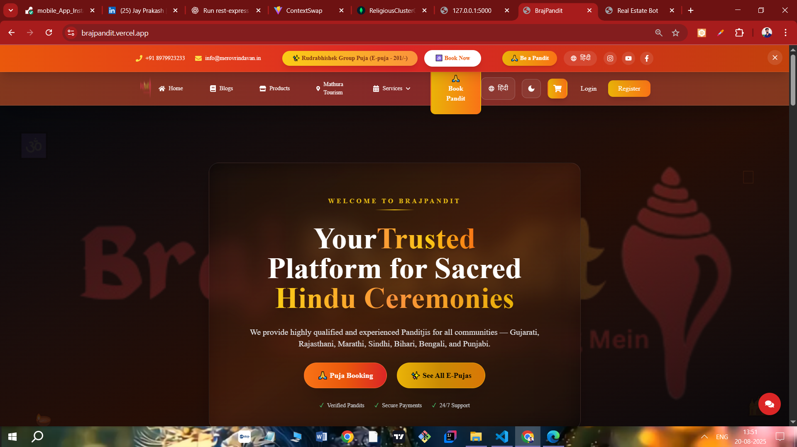

# 🖉️ Religious Website (Full-Stack Project)

<div align="center">

[Live Demo : Brajpandit.com](https://brajpandit.vercel.app/)

</div>

This repository contains the **full-stack implementation** of a modern and dynamic **Religious Website**, designed to provide spiritual services online — including Pandit booking, puja services, devotional products, and live Aarti & Bhajan streaming.

## 

## 🌟 Features

1. 📚 **Religious Product Store**
2. 🔥 **Pandit Booking & Appointment System**
3. 🙏 **Online Puja Path**
4. 🚩 **Mathura-Vrindavan & Hindu Festival Blogs**
5. 🎥 **Aarti & Bhajan Live Streaming**
6. 💳 **Secure Payment Gateway Integration**
7. 📅 **Event-Based Puja Scheduling**
8. 🌐 **Multiple Language Support**
9. 🛍️ **Hindu Festival Products Section**
10. 📞 **Query, Feedback, and Contact Support**

---

## 📁 Project Structure

```
📦 Religious Website Repository
│
├── frontend (React + Vite)
│   └── src, components, pages, routes, context, services, assets, etc.
│
├── backend (Node.js + Express + MongoDB)
│   └── routes, controllers, models, middleware, config, services, server.js
```

---

## 🚀 Getting Started

### 1️⃣ Backend Setup

#### Requirements:

- Node.js (v14+)
- MongoDB

```bash
cd backend
npm install
npm run dev
```

### 2️⃣ Frontend Setup

#### Requirements:

- Node.js
- React.js

```bash
cd frontend
npm install
npm run dev
```

---

## Environment Variables

### 📦 Backend `.env`

```
PORT=5000
MONGO_URI=your_mongodb_connection_string
JWT_SECRET=your_jwt_secret
PAYMENT_API_KEY=your_payment_gateway_key
```

### 📦 Frontend `.env`

```
REACT_APP_API_URL=http://localhost:5000/api
REACT_APP_PAYMENT_KEY=your_payment_gateway_key
```

---

## 📡 API Endpoints (Sample)

### 🧑‍💼 Authentication

- `POST /api/auth/register` – Register new user
- `POST /api/auth/login` – User login

### 🙏 Booking

- `POST /api/booking` – Book puja
- `GET /api/booking` – View bookings

### 💳 Payment

- `POST /api/payment/initiate` – Start payment session

---

## ⚖️ License & Usage Terms

> 📌 **This project is protected by copyright and is not open-source.**

- This source code is provided **for educational showcase and personal portfolio demonstration only**.
- You are **not allowed to reuse, copy, modify, fork, redistribute, or claim** this code as your own.
- Any unauthorized use or duplication may lead to a **DMCA takedown or legal action**.
- © 2025 Jay Rana – All Rights Reserved.

---

## 🙋‍♂️ Want to Collaborate or Learn?

If you're interested in a collaboration, internship, or mentorship, feel free to reach out. I'm open to sharing insights, learning, and working on exciting real-world projects!

---

## 📌 Deployment Coming Soon...

Live demo link will be provided once the deployment is completed.

---

🔰 **Thank you for visiting! Jai Shri Krishna!** 🔰
